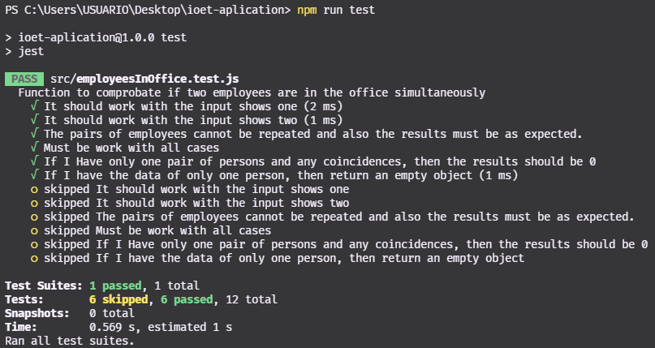
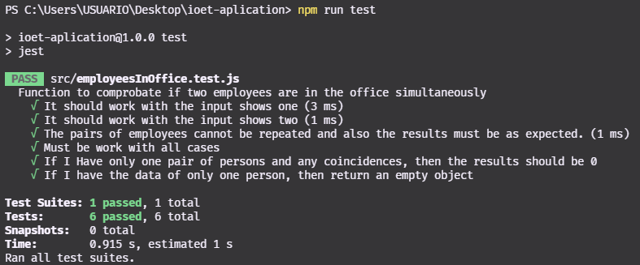

**INDEX:**

I did my best. I really hope my solution is according to a Frontend Junior position


- [To run the tests in your local machine](#to-run-the-tests-in-your-local-machine)
- [Synthesis of the solution](#synthesis-of-the-solution)
  - [Flow chart of the **Employees in Office** function](#flow-chart-of-the-employees-in-office-function)
  - [Tech Stack for this solution](#tech-stack-for-this-solution)
- [Step By Step to solve the challenge](#step-by-step-to-solve-the-challenge)
  - [Test Results](#test-results)
- [Conclusions and Recommendations](#conclusions-and-recommendations)

# To run the tests in your local machine

1. Clone the repo in your computer:

```bash
git clone https://github.com/Leninner/ioet-aplication.git
```

2. Install all the dependencies with:

> To do this step, you need to have **NodeJs** in the last version: 16.13.1

```bash
npm install
```

3. In the path `./src/employeesInOffice.test.js`, you will see:

```js
const PATH = 'C:\\Users\\USUARIO\\Desktop\\ioet-aplication\\src\\data\\setsOfData.txt';
```

- You need to change the PATH const according the path of the `setsOfData.txt` file in your machine, then type in the terminal:

```bash
npm run test
```

If the last not run and you get an error, then comment the lines 3 to 5 and pause de first `describe` in the line seven and unpause the second describe in the line 50:

- The 3 lines for comment

```js
const fs = require('fs');
const PATH = 'C:\\Users\\USUARIO\\Desktop\\ioet-aplication\\src\\data\\setsOfData.txt';
const arrayOfData = fs.readFileSync(PATH, 'utf8').split('\n');
```

- **Pause** the first describe in the line 7:

```js
// From this

describe('some word', () => {
  /*some tests*/
});

// To this

xdescribe('some word', () => {
  /*some tests*/
});
```

- **Unpause** the second describe in the line 50:

```js
// From this

xdescribe('some word', () => {
  /*some tests*/
});

// To this

describe('some word', () => {
  /*some tests*/
});
```

Then type in the terminal and see the results:



> If any of this solutions run, please let me know in whatsapp: https://wa.link/qx30wf

# Synthesis of the solution

The goal of this challenge was to output the info containing pairs of employees and how often they have coincided in the office:

- Input:


- Output:


To solve this challenge I used Javascript, which is a multi-paradigm language and many paradigms that I used was:

- Imperative Paradigm: We tell the computer what I want step by step
- I divided the functions into modules for a better understanding of the problem
- I tried to use good practices like SOLID principles
- To do Test Driven Development I used Jest

## Flow chart of the **Employees in Office** function


## Tech Stack for this solution


# Step By Step to solve the challenge

1. First of all, I need to know what data type I am receiving

   - I receive a string and the goal is to output an object with the result

```js
/**
 * @param {String} value
 * @returns {Object}
 */
```

2. I need to structure the string in a way that I can work without any problem, to do that I need the **Get Obj Structured** function, that help me to structure the string as the following way:

```js
// String
let data =
  'RENE=MO10:00-12:00,TU10:00-12:00,TH01:00-03:00,SA14:00-18:00,SU20:00-21:00|ASTRID=MO10:00-12:00,TH12:00-14:00,SU20:00-21:00|ANDRES=MO10:00-12:00,TH12:00-14:00,SU20:00-21:00';

let obj = {};

// Structured String

getObjStructured(obj, data);
/* {
    RENE: ['MO10-12', 'TU10-12', 'TH01-03', 'SA14-18', 'SU20-21'],
    ASTRID: ['MO10-12', 'TH12-14', 'SU20-21'],
    ANDRES: ['MO10-12', 'TH12-14', 'SU20-21'],
  };
*/
```

3. Next, I need the **Get Final Result** function that receive the structured object of the last step and help me to do a logical process and structure result object:

```js
getFinalResult(obj): // { 'RENE-ASTRID': 2, 'RENE-ANDRES': 2, 'ASTRID-ANDRES': 3 }
```

This two functions:

```js
getObjStructured(obj, value);
getFinalResult(obj);
```

Are use by the **Employees in Office** function for get the final Result

- Litle Synthesis:

1. Structure data
2. Getting final result


## Test Results



# Conclusions and Recommendations

This challenge was very useful for me. Was useful because I could improve my logical thinking and feel challenged to do the best I could, even though the exercise was complex for me.

After this problem, I am left with a huge desire to continue improving my development skills.

As recommendation:

- Specify which are the data type of the inputs and the outputs of the challenge.


