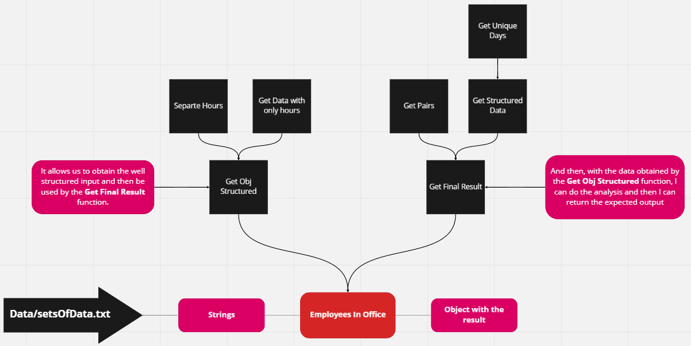

**INDEX**

- [Synthesis of the solution](#synthesis-of-the-solution)
  - [Flow chart of the **Employees in Office** function](#flow-chart-of-the-employees-in-office-function)
- [Step By Step to solve the challenge](#step-by-step-to-solve-the-challenge)
  - [Test Results](#test-results)
- [About me](#about-me)

# Synthesis of the solution

The goal of this challenge was to output the info containing pairs of employees and how often they have coincided in the office:

- Input:


- Output:


To solve this challenge I used Javascript, which is a multi-paradigm language and many paradigms that I used was:

- Imperative Paradigm: We tell the computer what I want step by step
- To do Test Driven Development I used Jest

## Flow chart of the **Employees in Office** function



# Step By Step to solve the challenge

1. First of all, I need to know what data type I am receiving

   - I receive a string and the goal is to output an object with the result

```js
/**
 * @param {String} value
 * @returns {Object}
 */
```

2. I need to structure the string in a way that I can work without any problem, to do that I need the **Get Obj Structured** function, that help me to structure the string as the following way:

```js
// String
let data =
  'RENE=MO10:00-12:00,TU10:00-12:00,TH01:00-03:00,SA14:00-18:00,SU20:00-21:00|ASTRID=MO10:00-12:00,TH12:00-14:00,SU20:00-21:00|ANDRES=MO10:00-12:00,TH12:00-14:00,SU20:00-21:00';

let obj = {};

// Structured String

getObjStructured(obj, data);
/* {
    RENE: ['MO10-12', 'TU10-12', 'TH01-03', 'SA14-18', 'SU20-21'],
    ASTRID: ['MO10-12', 'TH12-14', 'SU20-21'],
    ANDRES: ['MO10-12', 'TH12-14', 'SU20-21'],
  };
*/
```

3. Next, I need the **Get Final Result** function that receive the structured object of the last step and help me to do a logical process and structure result object:

```js
getFinalResult(obj): // { 'RENE-ASTRID': 2, 'RENE-ANDRES': 2, 'ASTRID-ANDRES': 3 }
```

## Test Results


# About me
